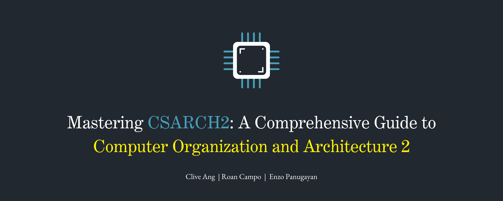
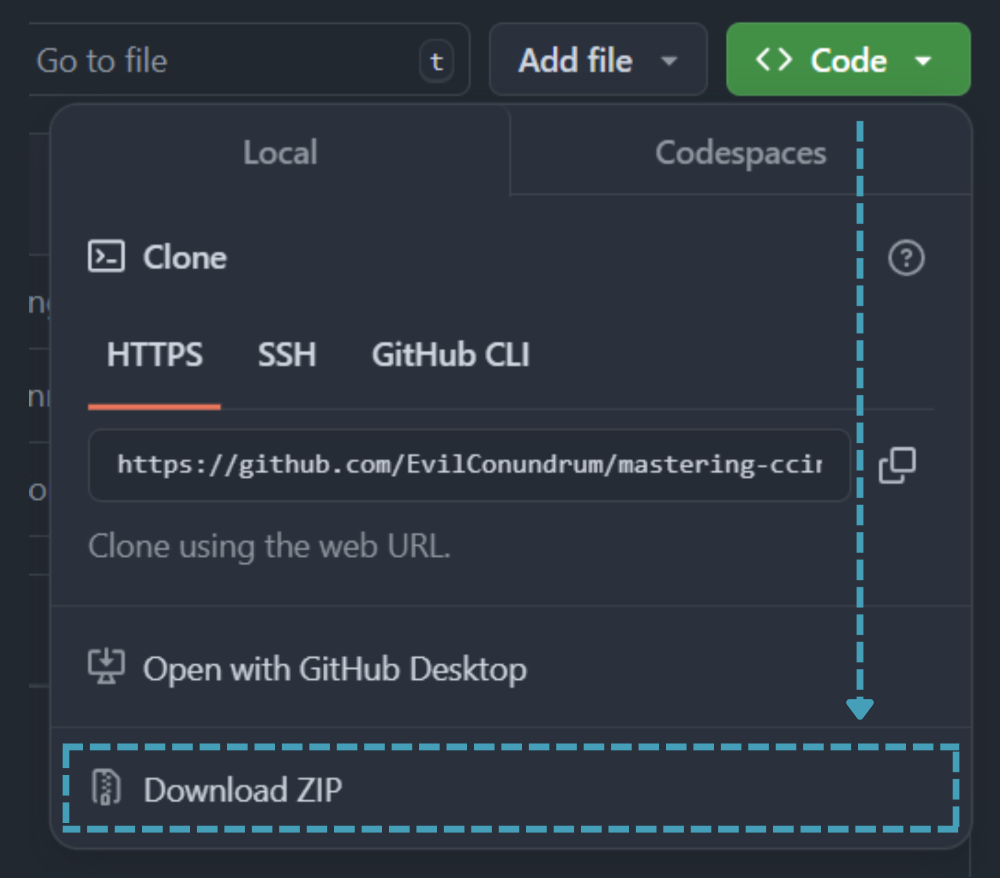

<p align="center">
  
  
  
  
</p>

## Table of Contents
- [Getting Started](#getting-started)
- [Course Content](#course-content)
- [Further Reading](#further-reading)
- [Contact](#contact)
## Getting Started

> [!Note]
> **Note**: This repository is still under development. Resources are being rolled out progressively, and new materials will be added over time. Feel free to check back regularly for updates.
> 
### Download with Git:

1. Clone the repository:
    ```bash
    git clone https://github.com/EvilConundrum/mastering-csarch2.git
    ```

2. Navigate to the repository directory:
    ```bash
    cd mastering-csarch2
    ```

3. Open the `curriculum` directory to access the content.

### Download Without Git:

1. Go to the top of this page and click the green Code button.

2. In the sub-menu, click "Download ZIP" as seen below:



3. Unzip the files.

4. Have fun with the materials!

## Course Content
```
mastering-csarch1/
├── curriculum/
├── resources/
│   └── images/
└── README.md
```
### Key Topics Covered

## Contact

For questions, mistakes, or feedback, feel free to reach out via:
- Email: [clive_jarel_c_ang@dlsu.edu.ph](mailto:clive_jarel_c_ang@dlsu.edu.ph)
- Discord: evilconundrum or EvilC#5174
- Github Issues: [Open an Issue](https://github.com/EvilConundrum/mastering-csarch2/issues)
